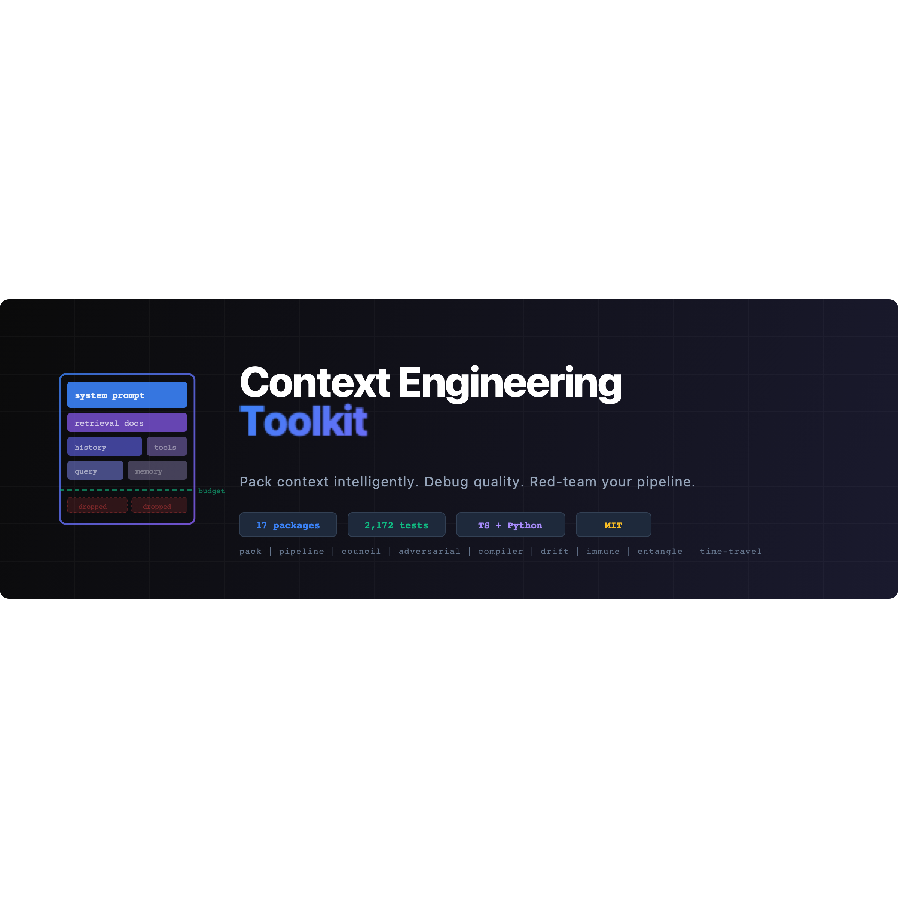

[](https://github.com/dr-gareth-roberts/context-engineering/actions/workflows/ci.yml)
[](https://opensource.org/licenses/MIT)
[](https://nodejs.org)
[](https://www.python.org)

**Most LLM apps waste 30–50% of their context window on redundant, stale, or irrelevant content.** This toolkit treats context as a first-class engineering problem — deciding _what goes into the window_, with scoring, caching, quality monitoring, adversarial testing, and multi-model orchestration.

A workspace of **17 TypeScript packages with full Python parity**, 2,200+ tests, and an interactive in-browser inspector. [Browse the Wiki →](./docs/wiki/Home.md)

```text
items + budget ──► score ──► place ──► pack ──► quality gate ──► trace
                    ▲          ▲                     │
              learned weights  cache topology   drift / immune / council
```

---

## Contents

- [The Problem](#the-problem) · [Novel Features](#novel-features) · [Packages](#all-packages)
- [Quick Start](#quick-start) · [Context Inspector](#context-inspector-web-app) · [Examples](#examples)
- [Installation](#installation) · [Python](#python) · [Architecture & Docs](#architecture--docs)
- [Development](#development) · [Security](#security) · [Contributing](#contributing) · [License](#license)

## The Problem

Every LLM call has a finite context window. System prompts, retrieved documents, conversation history, tool definitions, and user queries all compete for space. The naive approach — truncate the oldest messages — fails predictably:

- Loses the system prompt after enough turns
- Drops high-value documents randomly
- Wastes budget on stale or redundant items

This toolkit provides **algorithms for deciding what goes in**: relevance and priority scoring, budget allocation across content kinds, cache-aware ordering, redundancy elimination, quality scoring, and a deliberation/monitoring layer on top.

## Novel Features

These are not wrappers around existing APIs — they are new capabilities for managing context:

**Council of Experts** — Multiple LLM models with distinct perspectives (critic, architect, user-advocate) deliberate on a question through [4 structured strategies](./docs/wiki/Deliberation-Strategies.md): parallel, debate, stepladder (prevents anchoring bias), and delphi (anonymous with convergence detection).

**Adversarial Context Tester** — Red-team your context pipeline with [6 attack types](./docs/wiki/Adversarial-Testing.md): contradiction injection, noise flooding, subtle error mutation, authority spoofing, temporal poisoning, and relevance dilution. Catches vulnerabilities before production.

**Context Immune System** — Records failure patterns as fingerprints and develops [antibodies](./docs/wiki/Context-Immune-System.md) that screen future packs. Individual items can be fine but certain _combinations_ are toxic — the immune system learns these.

**Context Compiler** — [Declare what you want](./docs/wiki/Context-Compilation.md), not how to arrange it. Slots, constraints, and per-model optimisation passes for Claude, GPT-5.4, and Gemini 2.5. Like a C compiler targeting different architectures.

**Context Entanglement** — A [pub/sub mesh](./docs/wiki/Multi-Agent-Entanglement.md) for multi-agent systems. When Agent A discovers something, Agent B's next `pack()` automatically includes it — with scoped propagation, TTL expiry, and budget-aware injection.

**Drift Detector** — Monitors [6 quality dimensions](./docs/wiki/Drift-Detection.md) (relevance, redundancy, diversity, density, freshness, utilisation) across a sliding window. Alerts when your context is silently degrading before the model starts hallucinating.

**Context Time Travel** — [Git for context states](./docs/wiki/Context-Time-Travel.md). Checkpoint, rewind, fork, compare, and merge with 5 strategies (union, intersection, best-quality, highest-priority, manual).

**Semantic Boundary Segmentation** — Split documents at semantic boundaries (topic shifts, structural markers, perplexity spikes) rather than arbitrary token limits. Hybrid segmenters combine structural, semantic, and perplexity signals with boundary protection.

**Cache Topology Optimisation** — Orders items by volatility (static/session/request) so the stable prefix stays constant across requests. Up to 90% cost reduction with Anthropic's prefix caching.

**Causal Graph Compaction** — Uses [BEADS task graphs](./docs/causal-compaction.md) to prune conversation history by causal relevance, not recency. Protects root goals and task outcomes while aggressively pruning process noise from closed tasks.

## All Packages

Every package ships as a standalone module under [`packages/`](./packages/) with its own tests, plus a 1:1 Python implementation under [`python/context_engineering/`](./python/context_engineering/).

| Category         | Packages                                                                                                                                          | Purpose                                                                |
| ---------------- | ------------------------------------------------------------------------------------------------------------------------------------------------- | ---------------------------------------------------------------------- |
| **Core**         | [core](./packages/ce-core/) · [providers](./packages/ce-providers/) · [memory](./packages/ce-memory/) · [cli](./packages/ce-cli/)                 | Pack, score, diff, place, quality, cost, cache topology, BEADS handoff |
| **Multi-Model**  | [council](./packages/ce-council/) · [entangle](./packages/ce-entangle/) · [router](./packages/ce-router/)                                         | Experts debate; agents share context; route to the cheapest model      |
| **Quality**      | [adversarial](./packages/ce-adversarial/) · [immune](./packages/ce-immune/) · [debugger](./packages/ce-debugger/) · [drift](./packages/ce-drift/) | Red-team; learn from failures; diagnose outputs; monitor degradation   |
| **Optimisation** | [compiler](./packages/ce-compiler/) · [adaptive](./packages/ce-adaptive/) · [time-travel](./packages/ce-time-travel/)                             | Declarative compilation; learn weights; checkpoint/fork/merge          |
| **Integration**  | [sdk-interceptors](./packages/ce-sdk-interceptors/) · [frameworks](./packages/ce-frameworks/) · [rag](./packages/ce-rag/)                         | OpenAI/Anthropic wrappers; LangChain middleware; info-gain retrieval   |
| **Web**          | [web-client](./packages/ce-web-client/) · [web-server](./packages/ce-web-server/)                                                                 | The [Context Inspector](#context-inspector-web-app) app + Express host |

## Quick Start

> The packages are not yet published to a registry — run the snippets below **inside the cloned repo**, where imports resolve through the pnpm workspace. See [Installation](#installation) for setup, and [`examples/`](./examples/) for complete, runnable programs.

**Pack items into a budget** — the one primitive everything builds on:

```ts
import { pack } from "@context-engineering/core";

const result = pack(
  [
    { id: "system", content: "You are a helpful assistant.", priority: 10 },
    { id: "docs", content: "API reference documentation...", priority: 7 },
    { id: "history", content: "Previous conversation...", priority: 3 },
    { id: "query", content: "How do I authenticate?", priority: 9 },
  ],
  { maxTokens: 4096 }
);
// result.selected — items that fit, scored and sorted
// result.dropped  — items that didn't make the cut
```

**Compose a full pipeline** — allocate by kind, optimise cache topology, gate on quality:

```ts
import { pipeline } from "@context-engineering/core";

const result = pipeline(8000)
  .add(systemPrompt, tools, documents)
  .allocate([
    { kind: "system", targetRatio: 0.15 },
    { kind: "retrieval", targetRatio: 0.55 },
    { kind: "conversation", targetRatio: 0.3 },
  ])
  .cacheTopology({ provider: "anthropic" })
  .qualityGate({ minOverall: 0.5 })
  .build();
```

**Convene a Council of Experts** — multiple models deliberate, then synthesise:

```ts
import { createCouncil, ROLE_PRESETS } from "@context-engineering/council";

const council = createCouncil({
  members: [
    {
      id: "arch",
      name: "Architect",
      ...ROLE_PRESETS.pragmatist,
      provider: anthropic,
    },
    { id: "sec", name: "Security", ...ROLE_PRESETS.critic, provider: openai },
  ],
  strategy: "debate",
  rounds: 2,
  synthesizer: { provider: anthropic },
});

const result = await council.deliberate({
  query: "Microservices or monolith?",
});
```

The Python API mirrors this 1:1 — see [Python](#python).

## Context Inspector (web app)

An interactive, **fully client-side** inspector built on the toolkit itself (React + Vite, served in production by a hardened Express host). Paste items and a budget, then watch packing decisions unfold:

- **Token-budget bar** — see exactly what fit and what was dropped, by kind
- **Trace timeline** — step through every scoring and placement decision
- **Diff view** — compare two packs item-by-item
- **Causal playground** — explore BEADS task-graph compaction visually

```bash
pnpm install
pnpm dev          # http://localhost:3000 — runs entirely in the browser, no API keys
```

`pnpm build && pnpm start` serves the production build through the Express host in [`packages/ce-web-server/`](./packages/ce-web-server/), which adds security headers, rate limiting, graceful shutdown, and an optional `/api` proxy to a backend.

## Examples

Runnable demos — no API keys needed:

| Example                                                                                        | What it shows                                          |
| ---------------------------------------------------------------------------------------------- | ------------------------------------------------------ |
| [RAG Chatbot](./examples/rag-chatbot/)                                                         | Retrieval + info-gain filtering + pipeline packing     |
| [Code Review Council](./examples/code-review-council/)                                         | 3 experts debate a PR with convergence scoring         |
| [Production Agent](./examples/production-agent/)                                               | Drift detection + time-travel recovery + immune system |
| [Causal Compaction](./examples/causal-compaction/)                                             | BEADS task-graph compaction                            |
| [Context Compiler](./examples/context-compiler/)                                               | Declarative slots, constraints, per-model compilation  |
| [Adaptive Weights](./examples/adaptive-weights/)                                               | Learn scoring weights from quality feedback            |
| [Multi-Agent Entanglement](./examples/multi-agent-entanglement/)                               | Pub/sub context sharing between agents                 |
| [Full Pipeline](./examples/full-pipeline/)                                                     | Complete pipeline with allocation + quality gates      |
| [Webhook Telemetry](./examples/webhook-telemetry/)                                             | Streaming pack telemetry to external endpoints         |
| [Node Basic](./examples/node-basic/)                                                           | Minimal Node.js setup                                  |
| [Python Basic](./examples/python-basic/) · [Python Pipeline](./examples/python-full-pipeline/) | Minimal + full Python setups                           |

```bash
npx tsx examples/rag-chatbot/index.ts
npx tsx examples/code-review-council/index.ts
npx tsx examples/production-agent/index.ts
```

## Installation

The toolkit currently runs **from source**. Registry packages (`@context-engineering/*` on npm, `context-engineering-toolkit` on PyPI) are the intended distribution and will be published on the first tagged release — until then, clone and build.

**Requirements:** Node ≥ 20 (`.nvmrc` pins 22) · pnpm ≥ 10 · Python ≥ 3.11

```bash
git clone https://github.com/dr-gareth-roberts/context-engineering.git
cd context-engineering

# TypeScript workspace
pnpm install
pnpm build:all

# Python (pydantic-only core; optional extras below)
cd python
pip install -e ".[dev]"
```

The Python core depends only on `pydantic`. Optional extras pull in what each feature needs: `providers` (httpx, tiktoken), `server` (fastapi, uvicorn), `cli` (jsonschema), `logging` (structlog), `redis`, `postgres`, or `all`. See [`python/README.md`](./python/README.md).

## Python

The TypeScript and Python implementations are kept at feature parity — the same packing, scoring, council, drift, immune, time-travel, and compiler algorithms exist in both.

```python
from context_engineering import pack, ContextItem, Budget

result = pack(
    [
        ContextItem(id="system", content="You are a helpful assistant.", priority=10),
        ContextItem(id="query", content="How do I authenticate?", priority=9),
    ],
    Budget(max_tokens=4096),
)
# result.selected / result.dropped
```

Beyond the parity layer, [`python/context_framework/`](./python/context_framework/) provides **applied domain runtimes** — reference pipelines that wire the core toolkit into real workflows (security operations, claims processing, supply chain, clinical operations, pharmacovigilance, grid outage, AML, contract negotiation, and more). These are source-only references, not part of the published package.

## Architecture & Docs

- **[Wiki](./docs/wiki/Home.md)** — architecture overview and per-feature deep dives
- **[Roadmap](./docs/roadmap/)** · **[Plans](./docs/plans/)** — what's next and why
- **[Schemas](./schemas/)** — JSON Schemas for context items, packs, and BEADS issues (used by `ce lint`)
- **[Causal compaction](./docs/causal-compaction.md)** — the BEADS task-graph design

## Development

```bash
pnpm install && pnpm build:all     # build all TypeScript packages + the app
pnpm test:packages                 # all TypeScript unit tests
pnpm check:all && pnpm lint        # type-check + ESLint
pnpm format                        # Prettier

cd python
pip install -e ".[dev]"
python -m pytest                   # all Python tests
ruff check . && pyright            # lint + type-check
```

CI runs the full matrix on Node 20/22 and Python 3.11/3.12, with ESLint, Prettier, ruff, and a blocking pyright gate. A Husky pre-commit hook formats and lints staged files. See [CONTRIBUTING.md](./CONTRIBUTING.md).

## Security

Inputs are validated with Zod (TypeScript) and Pydantic (Python); file stores use atomic writes and parameterised SQLite queries; the web host sets security headers and rate limits. To report a vulnerability, see [SECURITY.md](./SECURITY.md).

## Contributing

Issues and PRs are welcome — see [CONTRIBUTING.md](./CONTRIBUTING.md) and the [Code of Conduct](./CODE_OF_CONDUCT.md). Browse the [Wiki](./docs/wiki/Home.md) for architecture context before diving in.

## License

[MIT](./LICENSE) © Dr Gareth Roberts
