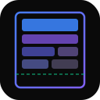

  

<h1 align="center">Context Engineering Toolkit</h1>

  <strong>Pack, debug, red-team, and orchestrate LLM context windows</strong> 
  <em>17 packages | 2,172 tests | TypeScript + Python</em>

---

## What is this?

A dual TypeScript/Python toolkit for managing what goes into LLM context windows. The core problem: given a finite token budget and a pile of potentially useful context (documents, conversation history, tool definitions, memories), which items should you include, in what order, and at what cost?

This toolkit provides algorithms, strategies, and infrastructure for that decision at every level — from basic packing to multi-model deliberation to adversarial testing of your context pipeline.

## Quick Navigation

### Getting Started

- [Installation & Setup](./Getting-Started.md) — npm/pip install, prerequisites
- [Core Concepts](./Core-Concepts.md) — items, scoring, budgets, volatility
- [Your First Pipeline](./First-Pipeline.md) — chain operations together

### Package Guide

- [Package Overview](./Package-Overview.md) — all 17 packages with architecture diagram
- **Core** — [ce-core](../../packages/ce-core/), [ce-providers](../../packages/ce-providers/), [ce-memory](../../packages/ce-memory/), [ce-cli](../../packages/ce-cli/)
- **Multi-Model** — [ce-council](../../packages/ce-council/), [ce-entangle](../../packages/ce-entangle/), [ce-router](../../packages/ce-router/)
- **Quality** — [ce-adversarial](../../packages/ce-adversarial/), [ce-immune](../../packages/ce-immune/), [ce-debugger](../../packages/ce-debugger/), [ce-drift](../../packages/ce-drift/)
- **Optimisation** — [ce-compiler](../../packages/ce-compiler/), [ce-adaptive](../../packages/ce-adaptive/), [ce-time-travel](../../packages/ce-time-travel/)
- **Integration** — [ce-sdk-interceptors](../../packages/ce-sdk-interceptors/), [ce-frameworks](../../packages/ce-frameworks/), [ce-rag](../../packages/ce-rag/)

### Deep Dives

| Topic                                                     | What you'll learn                                                   |
| --------------------------------------------------------- | ------------------------------------------------------------------- |
| [Deliberation Strategies](./Deliberation-Strategies.md)   | How parallel, debate, stepladder, and delphi strategies work        |
| [Adversarial Testing](./Adversarial-Testing.md)           | 6 attack types, severity scoring, CI/CD integration                 |
| [Context Compilation](./Context-Compilation.md)           | Declarative programs, slot-based allocation, per-model optimisation |
| [Drift Detection](./Drift-Detection.md)                   | 6 quality dimensions, trend detection, production alerting          |
| [Multi-Agent Entanglement](./Multi-Agent-Entanglement.md) | Scoped pub/sub mesh, propagation policies, budget-aware injection   |
| [Context Immune System](./Context-Immune-System.md)       | Fingerprinting, antibodies, failure pattern screening               |
| [Context Time Travel](./Context-Time-Travel.md)           | Checkpoint, fork, merge with 5 strategies                           |

### Reference

| Resource                                         | Description                                      |
| ------------------------------------------------ | ------------------------------------------------ |
| [Architecture](./Architecture.md)                | Design principles, data flow, package categories |
| [Core Concepts](./Core-Concepts.md)              | Items, scoring, budgets, quality metrics         |
| [CLI Reference](../../packages/ce-cli/README.md) | 11 CLI commands                                  |
| [Contributing](../../CONTRIBUTING.md)            | Development setup, code style, PR process        |
| [Changelog](../../CHANGELOG.md)                  | Release history                                  |

### Examples

| Example                                                    | What it shows                                             |
| ---------------------------------------------------------- | --------------------------------------------------------- |
| [RAG Chatbot](../../examples/rag-chatbot/)                 | Retrieval + information-gain filtering + pipeline packing |
| [Code Review Council](../../examples/code-review-council/) | 3 experts debate a PR (architect, security, performance)  |
| [Production Agent](../../examples/production-agent/)       | Drift monitoring + time travel + adversarial + immune     |
